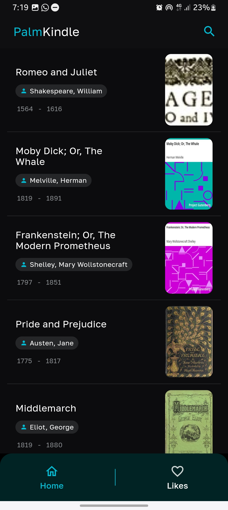
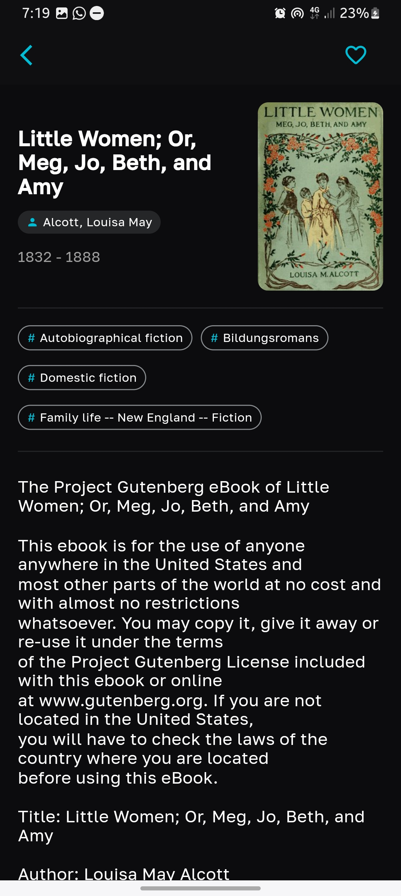

# PalmKindle 
<table>
  <tr>
    <p> 
     PalmKindle the perfect app for all your ebook reading needs! Just like Kindle, its offers reading experience, but with access to thousands of free ebooks thanks to the Gutendex API. You can easily find and read books you love, save your favorites, and search by title or author—all in one user-friendly app.
    </p> 
  </tr>
</table>
<table>

<table>
  <tr>
     <td>Home</td>
     <td>Detail</td>
     <td>Search</td>
  </tr>
  <tr>
    <td></td>
    <td></td>
    <td></td>
  </tr>
</table>

## More About
```
I haven't programmed this app to collect any personal information. All data, is stored solely on your device and
can be easily deleted by clearing the app's data or uninstalling it.
```
Explanations related to app architecture and technical decisions will be provided in future updates.

### How to Use the Repository

1. **Clone the Repository**
   - Open your terminal or command prompt.
   - Run the following command to clone the repository:
     ```sh
     git clone <repository-url>
     ```
   - Navigate to the project directory:
     ```sh
     cd <repository-directory>
     ```

2. **Ensure You Have the Latest IDE**
   - Make sure you're using the latest version of Android Studio or VSCode for the best development experience.

3. **Install FVM (Flutter Version Manager)**
   - FVM helps you manage Flutter SDK versions efficiently and avoids conflicts.
   - Install FVM by running the following command:
     ```sh
     dart pub global activate fvm
     ```
   - Once installed, use FVM to install the required Flutter version for this project:
     ```sh
     fvm install
     ```
   - Create an `.fvm` directory in your project to specify the Flutter version:
     ```sh
     fvm use <flutter-version>
     ```
   - Make sure to replace `<flutter-version>` with the required version specified in your project.

4. **Configure IDE to Use FVM**
   - For **VSCode**:
     - Install the **FVM** extension.
     - Open your project in VSCode.
     - Use the command palette (Ctrl+Shift+P) and select `FVM: Use` to set the Flutter SDK version for the project.

5. **Run the Project in Debug Mode**
   - After setting up FVM, run the project using the following command:
     ```sh
     fvm flutter run
     ```
